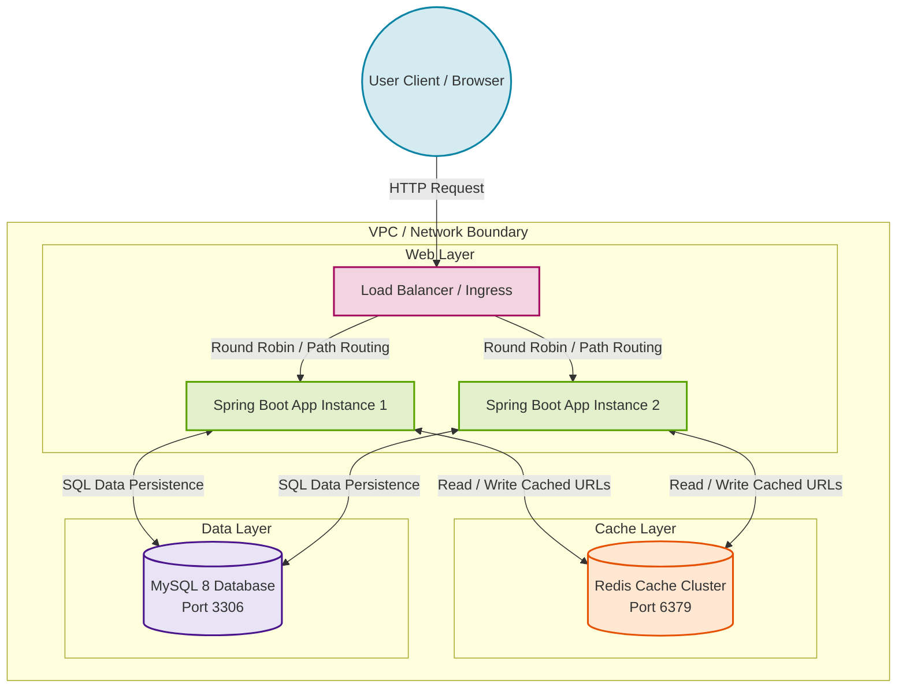
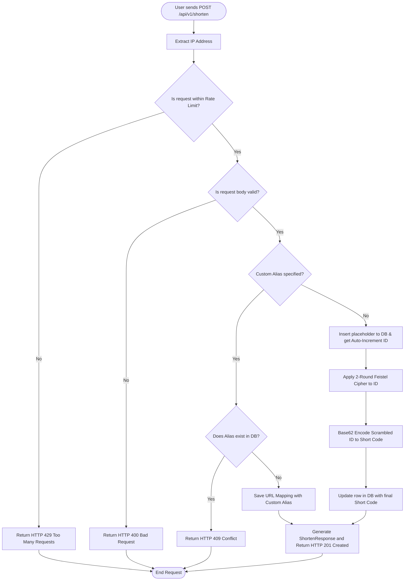
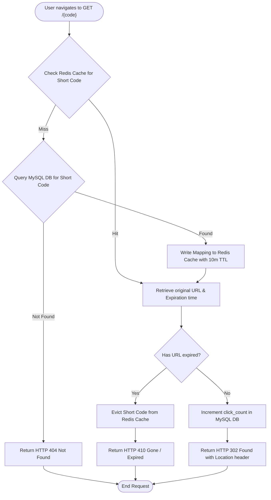
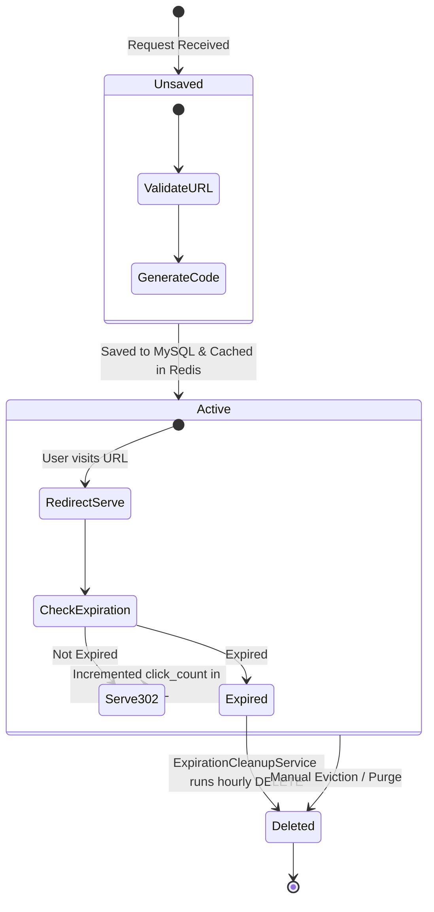
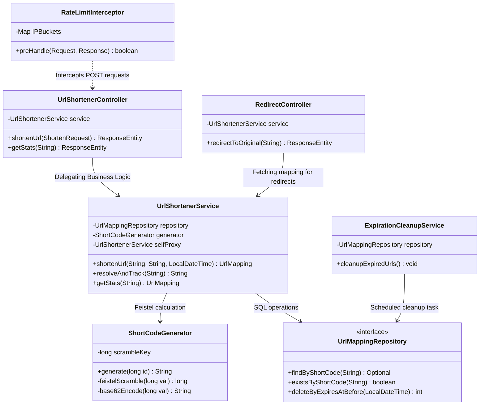
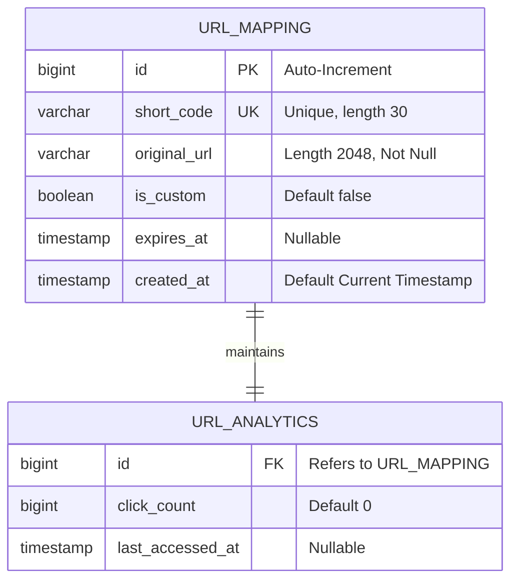

# System Architecture & Flow Diagrams

This document contains a comprehensive visual guide to the system architecture, component interactions, runtime flowcharts, and sequence diagrams of the URL Shortener project.


---

## 1. High-Level System Architecture

The following diagram illustrates how external traffic routes through the system components to either the in-memory Redis cache layer or the persistent database layer.



---

## 2. API End-to-End Execution Flows

### 2.1 Write Flow: URL Shortening Request

This flowchart shows the logical decision steps when a user requests to shorten a URL, including validation, rate-limiting check, alias lookup, Feistel cipher generation, and persistence.



### 2.2 Read Flow: URL Redirection Hot-Path

This sequence flowchart shows how the application uses Redis to serve redirects at sub-millisecond speeds, checking expiration, and handling database falls.



---

## 3. Data Lifecycle & State Transition

A shortened URL is represented as a state machine. It is created, accessed (redirected), updated, and eventually deleted either manually or automatically through the cleanup daemon.



---

## 4. Class & Component Relationships

The diagram below details the Spring Boot project components, how they depend on one another, and their single responsibilities.



---

## 5. UML Entity Relationship Diagram (ERD)

This physical ER diagram shows the schema structure of the `urls` entity, including types, keys, indexes, and nullability.



---

## 6. Formal UML Sequence Diagrams

### 6.1 UML Sequence: Creating a Short URL

This sequence diagram uses formal UML representations (Boundary, Control, Entity, Database) to map object interactions.

```mermaid
sequenceDiagram
    autonumber
    actor Client as Client / Browser
    box Application Tier
        boundary API as UrlShortenerController
        control Service as UrlShortenerService
        control Feistel as ShortCodeGenerator
    end
    box Database Tier
        database DB as MySQL Database
    end

    Client->>API: POST /api/v1/shorten (request)
    activate API
    API->>Service: shortenUrl(originalUrl, alias, expires)
    activate Service
    
    alt Custom Alias Path
        Service->>DB: existsByShortCode(alias)
        activate DB
        DB-->>Service: boolean
        deactivate DB
        
        alt Alias Already Exists
            Service-->>API: throws AliasAlreadyExistsException
            API-->>Client: HTTP 409 Conflict
        else Alias Available
            Service->>DB: save(UrlMapping)
            activate DB
            DB-->>Service: saved Entity
            deactivate DB
        end
    else Auto-Generate Path
        Service->>DB: save(Placeholder Mapping)
        activate DB
        DB-->>Service: Entity with ID (e.g. 101)
        deactivate DB
        
        Service->>Feistel: generate(101)
        activate Feistel
        Feistel-->>Service: short code (e.g. "aB3")
        deactivate Feistel
        
        Service->>DB: update short_code where id=101
        activate DB
        DB-->>Service: updated Entity
        deactivate DB
    end
    
    Service-->>API: ShortenResponse DTO
    deactivate Service
    API-->>Client: HTTP 201 Created (JSON body)
    deactivate API
```

### 6.2 UML Sequence: Redirecting a Short URL (GET Path)

```mermaid
sequenceDiagram
    autonumber
    actor Client as User Client
    box Application Tier
        boundary API as RedirectController
        control ServiceProxy as UrlShortenerService (Proxy)
        control Service as UrlShortenerService (Target)
    end
    box Cache / Persistence Tier
        participant Cache as Redis Cache
        database DB as MySQL Database
    end

    Client->>API: GET /{shortCode}
    activate API
    API->>ServiceProxy: resolveAndTrack(shortCode)
    activate ServiceProxy
    
    ServiceProxy->>Cache: Check for cached mapping
    activate Cache
    
    alt Cache Hit
        Cache-->>ServiceProxy: cached UrlMapping JSON
    else Cache Miss
        Cache-->>ServiceProxy: null
        ServiceProxy->>Service: getCachedMapping(shortCode)
        activate Service
        Service->>DB: findByShortCode(shortCode)
        activate DB
        DB-->>Service: Optional<UrlMapping>
        deactivate DB
        Service-->>ServiceProxy: UrlMapping
        deactivate Service
        
        ServiceProxy->>Cache: Write cache (TTL 10m)
    end
    deactivate Cache
    
    alt URL is Expired
        ServiceProxy-->>API: throws UrlExpiredException
        API-->>Client: HTTP 410 Gone
    else URL is Active
        Note over ServiceProxy,DB: Click increment runs synchronously
        ServiceProxy->>DB: incrementClickCount(id)
        activate DB
        DB-->>ServiceProxy: updated
        deactivate DB
        
        ServiceProxy-->>API: original URL String
        deactivate ServiceProxy
        API-->>Client: HTTP 302 Found (Location Header)
    end
    deactivate API
```
