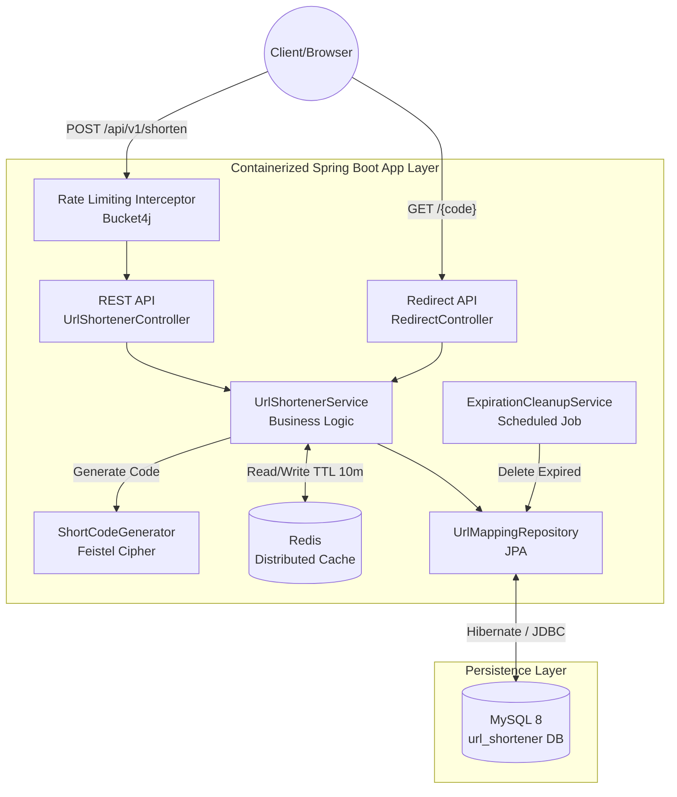
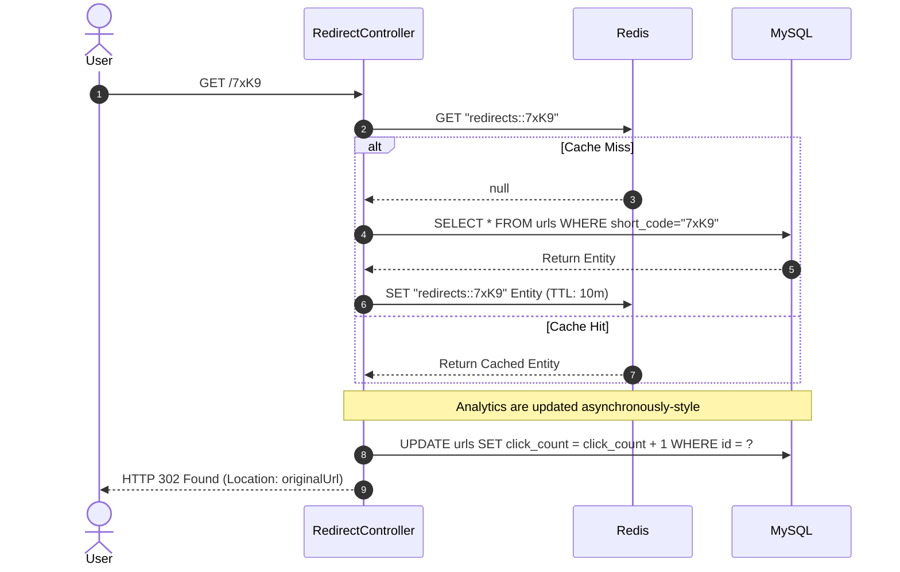

# URL Shortener: End-to-End System Design Document

This document serves as a comprehensive guide to the architecture, theoretical underpinnings, and concrete implementation details of our URL Shortener. It is structured from the highest level of system requirements down to the lowest level of mathematical cryptography and database indexing.

---

## 1. Introduction & System Requirements

A URL Shortener is a classic distributed systems problem. At its core, the system must take a long, unwieldy URL and map it to a short, unique alias. When a user visits the short alias, the system must redirect them to the original URL with minimal latency.

### 1.1 Functional Requirements
*   **URL Shortening**: Users can submit a long URL and receive a short URL (e.g., `http://short.ly/7xK9`).
*   **Custom Aliases**: Users can optionally specify a custom alias (e.g., `http://short.ly/my-blog`).
*   **Redirection**: Visiting a short link must redirect the user to the original long URL.
*   **Analytics**: The system must track how many times a short link has been clicked.
*   **Expiration**: Short links must expire after a configurable time-to-live (TTL).

### 1.2 Non-Functional Requirements
*   **High Availability**: The redirection path is mission-critical. If the system goes down, all shortened links across the internet break.
*   **Extremely Low Latency**: URL redirection should ideally take less than 10-20ms. It must not act as a bottleneck for users browsing the web.
*   **Read-Heavy Workload**: The system will experience significantly more read requests (redirects) than write requests (shortening). The read-to-write ratio is typically estimated at `100:1`.
*   **Unpredictability**: Generated short codes must not be easily guessable to prevent malicious scraping of all URLs in the system.

---

## 2. Capacity Planning & Scale

While this implementation is currently designed for a single-node deployment (backed by Docker), it is architected with massive scale in mind. 

### 2.1 Back-of-the-Envelope Estimates
Assume the system generates **100 million new URLs per month**.
*   **Write Requests**: `100M / (30 days * 24 hours * 3600 seconds) ≈ 40 writes/second`.
*   **Read Requests**: At a 100:1 ratio, the system will handle `4,000 reads/second`.
*   **Storage**: If a single URL mapping takes ~500 bytes (ID, original URL, short code, timestamps), 100M URLs require `50 GB / month`. Over 5 years, this is `3 TB` of database storage.

These metrics dictate that the **Database will quickly become a bottleneck for reads**, necessitating a robust caching layer.

---

## 3. High-Level Architecture & Topology

To meet our non-functional requirements, the system is separated into three distinct tiers.

### 3.1 Architecture Diagram



### 3.2 Technology Choices
*   **Application Layer (Java 21 / Spring Boot 3.4)**: Selected for enterprise-grade stability, excellent dependency injection, and a rich ecosystem (Spring Data, Spring Cache).
*   **Primary Datastore (MySQL 8.0)**: Selected for strict ACID compliance. The `UNIQUE` constraint on the short code column is critical to prevent race conditions when handling custom aliases.
*   **Caching Layer (Redis)**: Selected to offload the read-heavy redirect traffic from MySQL. Redis is an in-memory datastore capable of sub-millisecond response times.

---

## 4. Deep Dive: URL Shortening Algorithms

The most mathematically complex part of a URL shortener is how to generate the short code. The code must be short (ideally 6-7 characters), unique, and URL-safe.

We use **Base62 Encoding** (`[0-9][a-z][A-Z]`). A 7-character Base62 string allows for `62^7 = 3.5 Trillion` possible URLs.

### 4.1 Strategy Alternatives
1.  **MD5 Hashing**: Hash the original URL, take the first 7 characters. 
    *   *Flaw*: Collisions are highly likely. Handling collisions requires multiple database trips to check if the code exists, breaking performance.
2.  **Random String Generation**: Generate 7 random Base62 characters.
    *   *Flaw*: Same as MD5. As the database fills up, the chance of a collision increases (Birthday Paradox), requiring expensive retry loops.
3.  **Base62 Encode the Auto-Increment ID**: The database assigns an ID (e.g., `1000`). We encode it (`g8`).
    *   *Flaw*: Security. A malicious user can simply iterate `g8`, `g9`, `hA` to scrape every URL in our system and estimate our traffic.

### 4.2 Our Solution: The Feistel Cipher

To solve both collisions and predictability, we implemented a **2-Round Feistel Cipher**. A Feistel network is a symmetric structure used in block ciphers (like DES). Its most powerful property is that it creates a *bijective permutation* — a 1-to-1 mapping where every input produces exactly one unique, deterministic output, and no two inputs ever produce the same output.

**The Algorithm Flow:**
1.  The user submits a URL.
2.  We insert a placeholder row into MySQL. MySQL grants us a globally unique, auto-incrementing 64-bit integer ID (e.g., `10452`).
3.  We pass `10452` through the Feistel cipher using a secret Scramble Key.
4.  The cipher scrambles `10452` into a wildly different number, e.g., `8,492,019,384`.
5.  We encode `8,492,019,384` into Base62 -> `"7xK9p"`.
6.  We update the database row with the final `short_code`.

**Why this is brilliant:**
*   **O(1) Performance**: Pure math. Zero database lookups to check for collisions.
*   **Collision-Free**: Mathematically guaranteed by the bijection of the cipher.
*   **Unpredictable**: ID `10452` might become `7xK9p`, but ID `10453` becomes `a2Z4b`. Iteration is impossible for an attacker without the secret key.

---

## 5. Deep Dive: Caching & Redirection

Redirection is the hot path. If every redirect hits the database, MySQL will quickly become overwhelmed by disk I/O and connection limits.

### 5.1 The Redis Caching Strategy

We use **Redis** to cache the `shortCode -> originalUrl` mapping.



### 5.2 Trade-off: Consistency vs. Performance in Analytics
When a cache hit occurs, we bypass the database `SELECT`, but we still need to increment the `click_count`. 

Currently, we perform an immediate, synchronous `UPDATE` to MySQL on every redirect.
*   **Pros**: Perfect, real-time analytics accuracy.
*   **Cons**: The database is still taking a write-hit on every read.

*How to scale this further:* At massive scale, we would drop the synchronous `UPDATE`. Instead, we would write click events to an in-memory queue or an event stream like Apache Kafka. A separate background worker would read the stream and batch-update the database (e.g., `UPDATE urls SET count = count + 50`).

### 5.3 HTTP 301 vs 302 Redirects
Our system uses **HTTP 302 (Found)** by default, rather than 301 (Moved Permanently).
*   A `301` instructs the browser to cache the redirect permanently. The next time the user clicks the link, the browser handles it locally and *never hits our server*. This breaks our click-tracking analytics.
*   A `302` forces the browser to hit our server every single time, ensuring 100% accurate analytics, at the cost of slightly higher server load. (We made this configurable via `application.yml` for flexibility).

---

## 6. Database Schema & Indexing

The schema is heavily optimized for the specific queries the application runs.

```sql
CREATE TABLE urls (
    id BIGINT AUTO_INCREMENT PRIMARY KEY,
    short_code VARCHAR(255) NOT NULL UNIQUE,
    original_url TEXT NOT NULL,
    is_custom BOOLEAN NOT NULL DEFAULT FALSE,
    click_count INT NOT NULL DEFAULT 0,
    expires_at TIMESTAMP NULL,
    created_at TIMESTAMP DEFAULT CURRENT_TIMESTAMP,
    last_accessed_at TIMESTAMP NULL
);
```

### Indexing Strategy
1.  **`PRIMARY KEY (id)`**: Used by the URL generation logic to get a unique sequence number for the Feistel cipher.
2.  **`UNIQUE INDEX idx_short_code (short_code)`**: Crucial for custom aliases. If two users request the alias `my-blog` at the exact same millisecond, the database handles the race condition. One transaction succeeds; the other throws a `ConstraintViolationException`, which our app translates into an `HTTP 409 Conflict`. It also powers the `SELECT ... WHERE short_code=?` hot-read query on cache misses.
3.  **`INDEX idx_expires_at (expires_at)`**: Allows the background TTL cleanup job to quickly find expired rows without doing a full table scan.

---

## 7. Component Architecture & Spring Boot Patterns

The application codebase strictly adheres to enterprise design patterns.

1.  **MVC (Model-View-Controller)**: Separation of HTTP routing (`Controllers`) from business logic (`Services`).
2.  **DTO (Data Transfer Object) Pattern**: The API layer never exposes the `UrlMapping` JPA entity directly. We use `ShortenRequest` and `ShortenResponse` records. This prevents malicious data injection and decouples the API contract from the database schema.
3.  **Proxy & Self-Injection Pattern**: Spring Boot implements `@Cacheable` and `@Transactional` by wrapping classes in CGLIB Proxies. If a method inside a class calls another method inside the *same* class, the proxy is bypassed, breaking caching. We circumvented this using the **Self-Injection Pattern** (`@Autowired @Lazy private UrlShortenerService self`), explicitly routing internal calls back through the proxy.
4.  **Repository Pattern**: Spring Data JPA abstracts all boilerplate SQL, allowing us to interact with the database via domain-driven method names (`repository.findByShortCode`).

---

## 8. Background Processes & Data Lifecycle

Storage isn't infinite. Users can define an `expiresAt` timestamp when shortening a URL.

We implemented an `ExpirationCleanupService` using Spring's `@Scheduled` annotation.
Every hour, a background thread wakes up and executes a bulk delete:
`DELETE FROM urls WHERE expires_at < NOW()`

This keeps the database size manageable and ensures stale data is purged without impacting the performance of the user-facing web threads.

---

## 9. Security & Abuse Prevention

A public URL shortener is a prime target for abuse (spamming, phishing, DDoS).

### Rate Limiting (Bucket4j)
We protect the Write Path (`POST /shorten`) using the **Token Bucket Algorithm**, implemented via the `Bucket4j` library.
*   We use an **Interceptor Pattern** (`RateLimitInterceptor`). Before a request reaches the Controller, the interceptor checks an in-memory `ConcurrentHashMap` tracking the user's IP address.
*   If the user exceeds 20 requests per minute, the interceptor immediately rejects the request with `HTTP 429 Too Many Requests`.
*   *Note*: The Read Path (`GET /{code}`) is intentionally *not* rate-limited to ensure end-users clicking links are never blocked.
